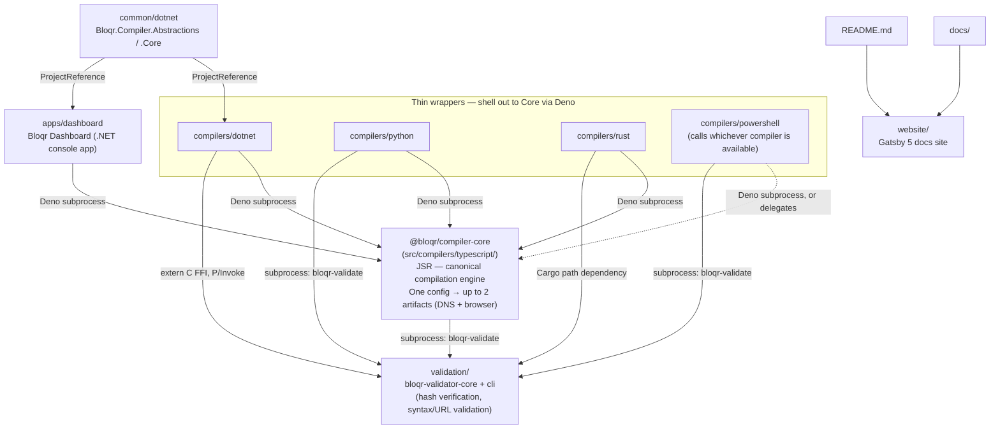

# Bloqr Core

A multi-language toolkit for compiling and validating AdGuard-syntax ad-blocking filter rules. Four independent rules compilers (TypeScript, C#/.NET, Python, Rust), a PowerShell toolkit, a Rust validation library, and a Gatsby documentation site all live here and share one configuration schema.

🚀 **Active development** — multi-language support, a Docker development environment, and CI/CD coverage across every component.

## What's in this repo

- **Rules compilers** for TypeScript/Deno, C#/.NET, Python, and Rust, plus a PowerShell toolkit — all reading the same JSON/JSONC configuration schema and producing identical output.
- **`@bloqr/compiler-core`** (`src/compilers/typescript/`) — the canonical, dependency-free compilation engine, published on [JSR](https://jsr.io/@bloqr/compiler-core). The .NET, Python, and Rust compilers shell out to it via Deno rather than reimplementing compilation logic.
- **BloqrCompiler PowerShell toolkit** (`src/compilers/powershell/`) — the sole cross-platform scripting-language compiler (PowerShell 7+ runs on Windows/Linux/macOS); class-based modules (`Common`, `BloqrCompiler`) with Pester test suites.
- **Validation library** (`src/validation/`) — a Rust validation library (`bloqr-validator-core`) and CLI (`bloqr-validator-core-cli`) for filter/config validation (hash verification, URL security, syntax linting).
- **Documentation website** (`website/`) — a Gatsby 5 site that builds guides, API reference, and security docs from `docs/` and this README.

**What moved out:** the compiled filter lists (and their input/archive files) now live in [`BloqrAI/bloqr-blocklists`](https://github.com/BloqrAI/bloqr-blocklists), and the AdGuard DNS API clients (.NET, TypeScript, Rust, PowerShell) plus the Linear import tool now live in [`BloqrAI/bloqr-apiclients`](https://github.com/BloqrAI/bloqr-apiclients). Neither is part of this repo anymore — see [Related repositories](#related-repositories) below.

## Prerequisites

| Requirement | Version | Needed for |
|-------------|---------|------------|
| Deno | 2.0+ | TypeScript compiler; also shelled out to by .NET/Python/Rust |
| .NET SDK | 10.0+ | .NET compiler |
| Python | 3.9+ | Python compiler |
| Rust | 1.85+ | Rust compiler, validation library |
| PowerShell | 7+ | PowerShell toolkit |
| Docker | 24.0+ | Containerized dev environment (optional) |

## Quick start

```bash
git clone https://github.com/BloqrAI/bloqr-core.git
cd bloqr-core

# Optional: check out the filter-list repo as a sibling directory so the
# sample configs' relative paths (../bloqr-blocklists/...) resolve as-is
git clone https://github.com/BloqrAI/bloqr-blocklists.git ../bloqr-blocklists
```

Then pick a compiler:

### TypeScript (Deno)

```bash
cd src/compilers/typescript
deno task compile              # compile with the default config
deno task interactive          # menu-driven interactive mode
deno task test                 # run tests
```

### .NET

```bash
cd src/compilers/dotnet
dotnet restore CompilerDotnet.slnx
dotnet run --project src/Bloqr.Compiler.Dotnet.Console -- --config config.json
dotnet test CompilerDotnet.slnx
```

### Python

```bash
cd src/compilers/python
pip install -e ".[dev]"
bloqr-compiler -c config.json
pytest
```

### Rust

Also published on [crates.io](https://crates.io/crates/bloqr-compiler) — `cargo install bloqr-compiler` installs the CLI directly, no clone needed.

```bash
cd src/compilers/rust/cli
cargo build --release
cargo run -- -c config.json
cargo test -p bloqr-compiler -p bloqr-compiler-core
```

### PowerShell

```powershell
Import-Module ./src/compilers/powershell/BloqrCompiler/BloqrCompiler.psd1
Invoke-BloqrCompiler
```

Every compiler supports JSON configuration (the .NET compiler and Dashboard also read JSONC), the full transformation set (`Deduplicate`, `Validate`, `RemoveComments`, `Compress`, and more — see [Configuration Reference](docs/configuration-reference.md)), and per-source inclusions/exclusions/transformations. YAML and TOML remain supported for backward compatibility but are no longer documented — see [Configuration Reference](docs/configuration-reference.md#supported-formats).

## Docker development environment

A pre-baked image with all toolchains installed:

```bash
docker build -f Dockerfile.warp -t ad-blocking-dev .
docker run -it -v $(pwd):/workspace ad-blocking-dev
```

Or with Docker Compose:

```bash
docker compose up -d dev            # start the dev environment
docker compose exec dev bash        # shell into it
docker compose --profile compile up # run every compiler once
docker compose --profile test run --rm test   # run all tests
```

## Architecture

```
bloqr-core/
├── src/
│   ├── compilers/typescript/    # TypeScript/Deno — canonical @bloqr/compiler-core (JSR)
│   ├── common/dotnet/            # C#/.NET 10 — shared library (own solution), consumed by the two below
│   ├── compilers/dotnet/    # C#/.NET 10 — library + Spectre.Console CLI
│   ├── compilers/python/         # Python 3.9+ — pip-installable package + CLI
│   ├── compilers/rust/           # Rust — single-binary CLI, zero runtime deps
│   ├── compilers/powershell/     # PowerShell modules + Pester tests (cross-platform scripting compiler)
│   ├── validation/                # Rust validation library (core/) + CLI (cli/)
│   ├── apps/dashboard/            # C#/.NET 10 — Dashboard console app
│   └── website/                  # Gatsby 5 documentation site
├── docs/                         # Guides, reference docs, security docs
└── schemas/                      # Shared configuration schema
```

The TypeScript compiler is the only one that implements compilation logic directly — it *is* `@bloqr/compiler-core`. The .NET, Python, and Rust compilers are thin wrappers that shell out to it via Deno, so behavior and output stay identical across languages; the PowerShell toolkit calls whichever compiler is available. `src/validation/` provides the shared hash-verification and syntax-validation layer that all of them rely on for security.

### Component relationships and dependencies



`common/dotnet` is a separate solution (`CompilerCommon.slnx`) consumed by both `compilers/dotnet` and `apps/dashboard` via `<ProjectReference>` — it isn't part of either consumer's own solution. `validation/` is reached differently per language: Rust links `bloqr-validator-core` as a Cargo path dependency, .NET P/Invokes the same code through an `extern "C"` FFI surface, and every other wrapper (TypeScript, Python, PowerShell, and the Rust/`.NET` compilers' own compiled output) shells out to the `bloqr-validate` CLI as a subprocess.

Since epic #432, a single configuration can route sources through two independent grammars — `dns` (server-side, DNS-sinkholing) and `browser` (client-side, browser-syntax) — via each source's `engine`/the config's `defaultEngine`. The two never merge into one file; a mixed-engine compile produces a DNS artifact and a separate browser-syntax artifact. See [Dual-Engine Compilation](docs/architecture/dual-engine-compilation.md) for the full architecture.

`@bloqr/compiler-core` is deliberately separate from Bloqr's commercial `@bloqr/compiler` product ([`BloqrAI/bloqr-compiler`](https://github.com/BloqrAI/bloqr-compiler)), which layers AST tooling, linting, plugins, and Cloudflare Workers deployment on top of this open-source engine — see [`src/compilers/typescript/README.md`](src/compilers/typescript/README.md#architecture) for the full relationship.

## Related repositories

| Repository | What it holds |
|---|---|
| [`BloqrAI/bloqr-blocklists`](https://github.com/BloqrAI/bloqr-blocklists) | Compiled filter lists and their input/output/archive files (`output/adguard_dns_filter.txt`, etc.) — no longer part of this repo |
| [`BloqrAI/bloqr-apiclients`](https://github.com/BloqrAI/bloqr-apiclients) | AdGuard DNS API clients (.NET, TypeScript, Rust, PowerShell) and the Linear import tool — no longer part of this repo |
| [`BloqrAI/bloqr-compiler`](https://github.com/BloqrAI/bloqr-compiler) | Bloqr's commercial compiler, built on top of `@bloqr/compiler-core` |

## Documentation

- [`docs/README.md`](docs/README.md) — full documentation index
- [`docs/getting-started.md`](docs/getting-started.md) — installation and first compilation
- [`docs/WHY_VALIDATION_MATTERS.md`](docs/WHY_VALIDATION_MATTERS.md) — why security validation is mandatory, start here
- [`docs/configuration-reference.md`](docs/configuration-reference.md) — full configuration schema
- [`docs/compiler-comparison.md`](docs/compiler-comparison.md) — feature comparison across all compilers
- [`docs/docker-guide.md`](docs/docker-guide.md) — Docker development environment
- [`docs/release-guide.md`](docs/release-guide.md) — creating releases with automatic binary builds
- [`CLAUDE.md`](CLAUDE.md) / [`.github/copilot-instructions.md`](.github/copilot-instructions.md) — AI agent instructions for working in this repo
- [`website/`](website/) — the Gatsby site that publishes the above as a browsable documentation site (`npm install && npm run develop` to preview locally)

## Testing

```bash
cd src/compilers/typescript && deno task test
cd src/compilers/dotnet && dotnet test CompilerDotnet.slnx
cd src/compilers/python && pytest
cargo test --workspace   # bloqr-compiler/-core + validation
Invoke-Pester -Path ./src/compilers/powershell -Recurse
```

See [`docs/guides/testing-guide.md`](docs/guides/testing-guide.md) for coverage tooling, CI examples, and troubleshooting.

## CI/CD

GitHub Actions validates every component on push and pull request: `.github/workflows/dotnet.yml`, `typescript.yml`, `python.yml`, `rust-clippy.yml`, `powershell.yml`, `gatsby.yml`, plus consolidated `security.yml` (CodeQL, DevSkim, PSScriptAnalyzer) and `validation-compliance.yml` (runs the Rust validator against fixtures). See [CI/CD Alignment](CLAUDE.md#cicd-alignment) in `CLAUDE.md` for the full list.

## Contributing

See [`CONTRIBUTING.md`](CONTRIBUTING.md) for the development workflow, coding standards, and pull request process. Report security issues per [`SECURITY.md`](SECURITY.md) rather than filing a public issue.

## License

See [`LICENSE`](LICENSE).
