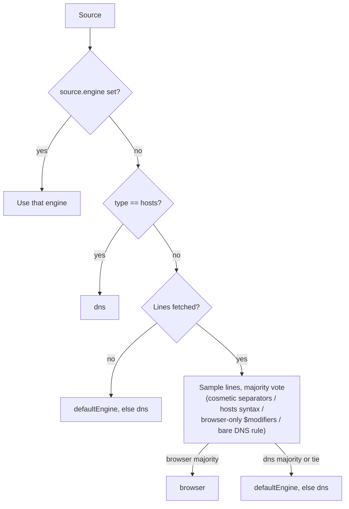
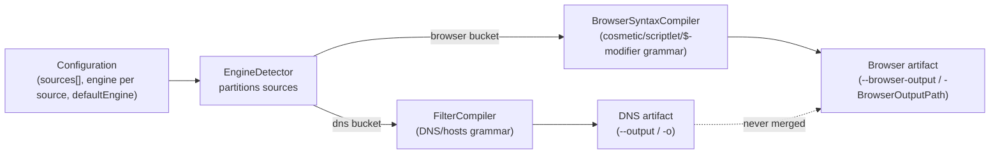

# Dual-Engine Compilation

**Status**: Active, shipped incrementally across epic [#432](https://github.com/BloqrAI/bloqr-core/issues/432) (Waves 0–3, merged).
**Scope**: `@bloqr/compiler-core` (`src/compilers/typescript/`) and every wrapper that shells out to it (`.NET`, Python, Rust, PowerShell), plus the Dashboard and Launcher.

This is the open-source analogue of the commercial compiler's `docs/architecture/browser-syntax-engine.mdx` — same underlying concept, but describing this repo's own implementation rather than `bloqr-compiler`'s.

## Nomenclature

Per epic #432's own resolution (adopted as-is, so this repo and the commercial compiler use the same words):

- **Server-side** (`engine: "dns"`) — DNS-sinkholing rules: hosts-file/domain-blocking syntax. This is what every compiler in this repo produced before dual-engine support existed, and remains the default.
- **Client-side** (`engine: "browser"`) — browser-syntax rules: cosmetic/element-hiding rules, extended-CSS, scriptlet injection, and `$`-modifier network rules that only a browser extension/app can act on — a DNS resolver has no concept of a CSS selector or a `removeparam` modifier.

End users never need to know the difference; both artifacts come from **one config, one compile**.

## How `EngineDetector` routes a source

`src/compilers/typescript/src/engines/EngineDetector.ts` resolves each source to an engine, in this order (`detectSourceEngine`):

1. **Explicit `source.engine`** — always wins when set.
2. **`source.type === "hosts"`** — hosts-format sources are unambiguously DNS; no sniffing needed.
3. **Content sniffing** (`detectEngineFromLines`) — once a source's lines are fetched, each non-empty, non-comment line is classified and the majority vote decides:
   - AdGuard cosmetic separators (`##`, `#@#`, `#?#`, `#$#`, `#@$#`, `#%#`, `#@%#`) → `browser`, unconditionally (exclusively a client-side grammar).
   - A hosts-file line (`0.0.0.0 example.com`, `::1 example.com`, …) → `dns`, unconditionally.
   - A network rule (`||…`, `@@||…`, `|…`) with a `$modifier` list → `browser` if any modifier is browser-only (`script`, `stylesheet`, `csp`, `removeparam`, `redirect`, `elemhide`, …, see the full list in `EngineDetector.ts`), otherwise `dns`.
   - A bare adblock-style domain rule with no such signal → `dns`.
   - Anything that produces no signal is skipped; ties (including an all-skipped sample) fall through to the next step.
4. **`configuration.defaultEngine`**, if set.
5. **`"dns"`** — the final, hard-coded fallback.

`groupSourcesByEngine` then buckets every source in a configuration into `{ dns: [...], browser: [...] }`, preserving relative order within each bucket, and `MultiEngineCompiler.partitionConfiguration` turns that into up to two full `IConfiguration` objects (same top-level metadata, disjoint `sources`) that each get compiled independently.

## Two artifacts, never merged

`MultiEngineCompiler` (`src/compilers/typescript/src/engines/MultiEngineCompiler.ts`) routes the `dns` bucket to the existing `FilterCompiler` and the `browser` bucket to `BrowserSyntaxCompiler`, and returns `{ dns?: CompilationResult, browser?: CompilationResult }` — each key present only if that bucket had sources. **The two results are never concatenated or written to the same file.**

This is a deliberate data-safety decision, stated directly in the epic body: the two grammars are consumed by fundamentally different engines (a DNS resolver vs. a browser extension/app), and applying a DNS-only transformation to browser rules — or vice versa — would silently corrupt output rather than fail loudly. Concretely:

- DNS resolvers have no concept of an element-hiding rule, a CSS injection rule, or an extended-CSS selector; writing those into a hosts-style DNS artifact produces syntax the resolver can't parse (in the best case) or garbage rules it silently ignores (in the worse case).
- A DNS-only transformation applied to a browser artifact can be actively destructive rather than merely inert — the canonical example is `RemoveModifiers`, whose entire job is stripping AdGuard-DNS-incompatible `$` modifiers. Applied to browser-syntax rules, it strips exactly the modifiers (`script`, `csp`, `removeparam`, …) that make those rules meaningful, silently degrading them into something else.

So the compilers never give a transformation the chance to run across both grammars in one pass, and the two outputs are kept as two files precisely so each can be consumed by the engine that understands it, and so a bug in one grammar's pipeline can never corrupt the other's already-written output.

## Which transformations are browser-safe

`BrowserSyntaxCompiler.ts` enforces this at compile time, not just by convention — `BROWSER_SAFE_TRANSFORMATIONS` is an explicit allow-list, and any transformation outside it configured on a browser-engine source (or the top-level `transformations` list, when it reaches a browser bucket) throws a `ConfigurationError` rather than silently running:

| Transformation | Browser-safe? | Why |
|---|---|---|
| `RemoveComments` | ✅ | Comment syntax (`!`/`#`) is shared across both grammars |
| `Deduplicate` | ✅ | Exact-string dedup has no grammar dependency |
| `RemoveEmptyLines` | ✅ | Whitespace-only, grammar-independent |
| `TrimLines` | ✅ | Whitespace-only, grammar-independent |
| `InsertFinalNewLine` | ✅ | POSIX formatting, grammar-independent |
| `ConvertToAscii` | ✅ | IDN→punycode conversion applies to domains in either grammar |
| `RemoveModifiers` | ✅ | Browser-syntax-aware variant strips only DNS-incompatible modifiers, not the browser-only ones that give a browser rule its meaning |
| `ConflictDetection` | ✅ | Detects contradictory rules; grammar-independent |
| `RuleOptimizer` | ✅ | Structural optimization that doesn't depend on which engine consumes the rule |
| `Compress` | ❌ (DNS-only) | Converts hosts-format lines to adblock syntax — hosts format doesn't exist in the browser grammar, so this transformation is meaningless outside the DNS bucket |
| `Validate` / `ValidateAllowIp` | ❌ (DNS-only) | The DNS-grammar validator rejects cosmetic/browser rules outright (see `src/validation/core/src/syntax.rs`'s `test_cosmetic_rules_rejected`) — running it against browser output would abort every compile that has any cosmetic rule at all |
| `InvertAllow` | ❌ (DNS-only) | `@@` exception-rule inversion is defined against the DNS/adblock network-rule grammar, not cosmetic rules |

A configuration mixing engines can still request a DNS-only transformation — it just has to be scoped so it only ever reaches DNS-bucket sources (global `transformations` apply to every source, so a DNS-only transformation at the top level and a browser-engine source in the same config is the exact case this allow-list exists to reject).

**Interim validation gap:** `bloqr-validate` (the shared syntax validator every wrapper runs fail-closed) does not yet validate browser syntax natively — it currently rejects all cosmetic rules outright. Until that lands (tracked separately, gates epic #432's closure), compiling any browser-engine source requires the `--allow-unvalidated-output` escape hatch already implemented across all five wrappers (`docs/VALIDATION_ENFORCEMENT.md`). This is explicit and time-boxed, not a silent gap in the fail-closed guarantee.

## Backward compatibility

Omitting `engine` and `defaultEngine` everywhere in a configuration keeps behavior byte-identical to before dual-engine support existed: every source resolves to `dns` (step 5 of the resolution order above, immediately — the `browser` code path is never reached, no second artifact is produced), and the compiler takes the exact same `FilterCompiler`-only path it always has. This is tested, not just asserted — see `MultiEngineCompiler.test.ts`'s *"all-DNS config produces byte-identical output to FilterCompiler directly"* and `compiler.dual-engine.test.ts` in the TypeScript core, plus each wrapper's own coverage added in Wave 2. See [Configuration Reference](../configuration-reference.md#dual-engine-compilation-engine--defaultengine) for the field-level documentation and the full CLI flag table.

## Ownership split with the commercial compiler

Epic #432's body has a dedicated "Ownership decision" section; summarized here as context for why this layer lives in `bloqr-core` at all:

- **`@bloqr/compiler-core` (this repo, OSS) is the single owner** of `EngineKind`, `EngineDetector`, `BrowserSyntaxCompiler`, `MultiEngineCompiler`, and dual-output orchestration. Before this epic, the commercial `bloqr-compiler` repo had already built its own `src/engines/` layer (from its own earlier work, `bloqr-compiler#2207`) on top of **local forks** of `SourceCompiler`/`FilterCompiler`/`ConfigurationValidator` rather than on `@bloqr/compiler-core`'s exports — meaning without a coordinated migration, two independently-maintained engine implementations would drift apart.
- **The fix:** `bloqr-compiler` deletes its own `src/engines/` and re-exports this package's instead, once the JSR release lands (a minor version bump, picked up automatically under its existing `^1.0.0` dependency range). Core ships first; the commercial migration follows.
- **What stays commercial-only**, unaffected by this migration: AGLint auto-fix and tsurlfilter-based deep/semantic validation of browser output (per `docs/adr/0002-aglint-integration-strategy.md` — a separate, heavier tooling layer on top of parsing, distinct from the OSS syntax validation `bloqr-validator-core` is gaining), worker/Cloudflare deployment surfaces, the Angular frontend, and AST *manipulation* beyond what compiling needs (diff reports, plugin system, etc.).
- **What's OSS here**: the full detection/routing/dual-output layer described in this document, `AGTree`-superset parsing (via the open `@adguard/agtree` npm package — not gated to the commercial product), and native browser-syntax *syntax validation* in `bloqr-validator-core` (in progress, gates epic closure) — as opposed to AGLint/tsurlfilter's auto-fix and deep-semantic validation, which stay commercial.

## See also

- [Configuration Reference](../configuration-reference.md#dual-engine-compilation-engine--defaultengine) — `engine`/`defaultEngine` field reference and the CLI flag table across all five wrappers
- [`src/compilers/typescript/README.md`](../../src/compilers/typescript/README.md) — `@bloqr/compiler-core`'s own README, including its relationship to the commercial compiler
- [`docs/VALIDATION_ENFORCEMENT.md`](../VALIDATION_ENFORCEMENT.md) — the fail-closed validation guarantee and the `--allow-unvalidated-output` escape hatch
- [`docs/adr/0002-aglint-integration-strategy.md`](../adr/0002-aglint-integration-strategy.md) — why AGLint stays commercial-only
