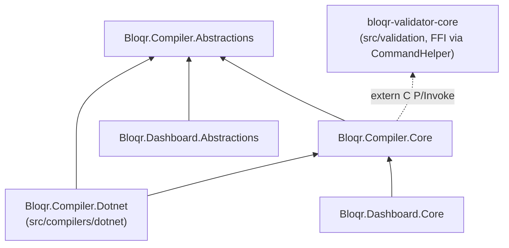

# Compiler Common (.NET)

The shared .NET library behind this repo's `.NET` filter-rules compiler and the Dashboard: `Bloqr.Compiler.Abstractions` and `Bloqr.Compiler.Core`. Neither project contains compiler-specific logic — both are pure shared building blocks, consumed by [`src/compilers/dotnet/`](../../compilers/dotnet/) and [`src/apps/dashboard/`](../../apps/dashboard/) via `<ProjectReference>`.

## Why this is its own solution

`Bloqr.Compiler.Abstractions`/`Core` used to live inside the .NET compiler's own solution (now `CompilerDotnet.slnx`, then still named `RulesCompiler.slnx`). Functionally they were already a shared library — the Dashboard referenced them across directories the same way it does today — but structurally they weren't isolated from the compiler's own solution. This directory and `CompilerCommon.slnx` exist so the common library can be built, tested, and versioned independently of either consumer, and so its build doesn't imply "you're building the compiler."

## Projects

| Project | Description | Dependencies |
|---------|-------------|--------------|
| `Bloqr.Compiler.Abstractions` | Interfaces, event-args, and shared model/DTO types. No implementation, no external dependencies beyond the framework. | None |
| `Bloqr.Compiler.Core` | The common implementation: multi-format config reading/validation, chunking, file locking, hash verification, output publishing, the compilation event pipeline, structured JSON logging, and the plugin system. | `Bloqr.Compiler.Abstractions` |

## Installation

```bash
cd src/common/dotnet
dotnet restore CompilerCommon.slnx
dotnet build CompilerCommon.slnx
```

## Consuming this library

In-repo consumers reference the projects directly rather than through a package feed:

```xml
<ProjectReference Include="..\..\..\common\dotnet\src\Bloqr.Compiler.Abstractions\Bloqr.Compiler.Abstractions.csproj" />
<ProjectReference Include="..\..\..\common\dotnet\src\Bloqr.Compiler.Core\Bloqr.Compiler.Core.csproj" />
```

`Bloqr.Compiler.Dotnet` (`src/compilers/dotnet/`) references both. `Bloqr.Dashboard.Abstractions` references `Bloqr.Compiler.Abstractions`; `Bloqr.Dashboard.Core` references `Bloqr.Compiler.Core`. There's no reason to make an in-repo build round-trip through a package feed — `<ProjectReference>` gives identical `dotnet publish --self-contained` output at zero extra latency. See [`docs/architecture/nuget-distribution-strategy.md`](../../../docs/architecture/nuget-distribution-strategy.md) for the full decision record.

Out-of-repo consumers (a future .NET MAUI host, or this library becoming its own repo) can instead take it as a NuGet package — see [Publishing](#publishing) below.



`Bloqr.Compiler.Core` carries the dual-engine (DNS/browser) `engine`/`browserOutputPath` plumbing added in epic #432 — hash verification and output publishing here handle up to two artifacts per compile, not one. See [Dual-Engine Compilation](../../../docs/architecture/dual-engine-compilation.md).

`Bloqr.Compiler.Dotnet` references both projects directly. On the Dashboard side, `Bloqr.Dashboard.Abstractions` references only `Bloqr.Compiler.Abstractions` (keeping the embeddable-library API boundary free of implementation dependencies), while `Bloqr.Dashboard.Core` references `Bloqr.Compiler.Core` for the actual compile/validate operations.

## API Reference

### Interfaces (`Bloqr.Compiler.Abstractions`)

| Interface | Description |
|-----------|-------------|
| `IConfigurationReader` | Reads and parses configuration files (JSON/JSONC documented; YAML/TOML backward-compatible) |
| `IBloqrCompilerService` | Top-level compilation orchestration |
| `IFilterCompiler` | Compiles filter rules |
| `IOutputWriter` / `IOutputPublisher` | Output file operations: writing, conflict strategy, archiving |
| `IChunkingService` | Chunked compilation for large rule lists |
| `IFileLockService` | File-locking around compilation output |
| `IPluginManager` | Plugin discovery and validation |
| `IHashDatabaseService` | Hash verification sidecar (`.hashes.json`) reads/writes |
| `IBloqrValidatorService` | Syntax/URL validation via the native `bloqr-validator` library |
| `ICompilationEventDispatcher` / `ICompilationEventHandler` | The compilation event pipeline |
| `ICompilationPipeline` / `ICompilationPipelineBuilder` / `ICompilationMiddleware` | Middleware-based compilation pipeline |
| `IConfigurationFormatPlugin` / `IOutputDestinationPlugin` / `IRuleTransformationPlugin` / `IRuleValidationPlugin` / `IPlugin` | Plugin system extension points |

### Models (`Bloqr.Compiler.Abstractions`)

| Model | Description |
|-------|-------------|
| `CompilerConfiguration` | Configuration file model with all compiler options |
| `FilterSource` | Source filter list definition |
| `CompilerResult` | Compilation result with metrics |
| `CompilerOptions` | Compilation options (verbose, validate, etc.) |
| `Transformation` | Enum of all available transformations |
| `SourceType` | Enum for source types (adblock, hosts) |
| `VersionInfo` | Component version information |
| `PlatformInfo` | Platform-specific information |
| `ConfigurationFormat` | Enum for JSON/YAML/TOML formats (JSON/JSONC documented; YAML/TOML supported for backward compatibility only) |
| `ValidationResult` / `ValidationError` | Shared validation-result shape |
| `SyntaxValidationResult` / `UrlValidationResult` | `bloqr-validator` result shapes |
| `OutputSettings` / `HashVerificationSettings` / `ArchivingSettings` | Output-publishing and hash-verification configuration |
| `HashDatabaseEntry` / `OutputPublishResult` | Hash-verification and output-publishing results |
| `ChunkingOptions` / `ChunkMetadata` | Chunked-compilation configuration and metadata |
| Event-args types (`CompilationStartedEventArgs`, `CompilationCompletedEventArgs`, `CompilationErrorEventArgs`, `ConfigurationLoadedEventArgs`, `ChunkEventArgs`, `HashComputedEventArgs`, `HashVerifiedEventArgs`, `HashMismatchEventArgs`, `SourceLoadingEventArgs`, `SourceLoadedEventArgs`, `FileLockEventArgs`, `ValidationEventArgs`) | Payloads for the compilation event pipeline |

### Services (`Bloqr.Compiler.Core`)

| Service | Description |
|---------|-------------|
| `ConfigurationReader` | Parses JSON/JSONC (documented), YAML, and TOML (backward compatible) configs with snake_case support |
| `ConfigurationValidator` / `CompilerConfigJsonSchemaValidator` | Validates configuration against the shared JSON Schema (`schemas/compiler-config.schema.json`) |
| `ChunkingService` | Chunked parallel compilation for large rule lists |
| `FileLockService` | File-locking around compilation output |
| `PluginManager` | Plugin discovery, loading, and validation |
| `CompilationPipeline` / `CompilationPipelineBuilder` | Middleware-based compilation pipeline |
| `CompilationEventDispatcher` / `QueuedCompilationEventDispatcher` | Compilation event pipeline, with an opt-in background-queueing decorator and Polly retry policy |
| `HashDatabaseService` | Reads/writes the `.hashes.json` hash-verification sidecar |
| `OutputPublisher` | Output-publishing with conflict strategy and archiving |
| `BloqrValidatorService` (+ `RulesValidatorNativeMethods`) | P/Invoke wrapper around the native `bloqr-validator` library |
| `CommandHelper` / `PlatformHelper` | Generic process-execution and platform-detection utilities |
| `StructuredJsonLogFormatter` | Structured JSON log formatting shared by the console apps |

## Dependency Injection

`Bloqr.Compiler.Core` ships DI registration extensions per concern (`EventDispatchingServiceCollectionExtensions`, `LoggingServiceCollectionExtensions`); consumers compose them alongside their own compiler-specific registrations rather than a single `AddCompilerCommon()` — see `Bloqr.Compiler.Dotnet`'s `AddBloqrCompiler()` extension for the pattern.

## Running Tests

`Bloqr.Compiler.Core.Tests` covers everything that doesn't need a `Bloqr.Compiler.Dotnet`-specific fixture — `ConfigurationReader`, `ConfigurationValidator`, `CompilerConfigJsonSchemaValidator`, `ChunkingService`, `HashDatabaseService`, `OutputPublisher`, `BloqrValidatorService`, `CompilationEventDispatcher`/`QueuedCompilationEventDispatcher`, `PlatformHelper`, `StructuredJsonLogFormatter`, the DI extensions, and the `Bloqr.Compiler.Abstractions` models/enums:

```bash
cd src/common/dotnet
dotnet test CompilerCommon.slnx
```

`Bloqr.Compiler.Dotnet`-specific behavior (`BloqrCompilerService`, `OutputWriter`) stays covered by `Bloqr.Compiler.Dotnet.Tests` (`src/compilers/dotnet/src/Bloqr.Compiler.Dotnet.Tests/`), which references `Bloqr.Compiler.Dotnet` and, transitively, this library — see that project's own test run instructions.

`build.sh`/`build.ps1` build this solution but don't run any .NET tests (neither do they for `CompilerDotnet.slnx`/`BloqrDashboard.slnx`) — test execution is CI-only, via `.github/workflows/dotnet.yml`'s matrix.

## Publishing

Both packages publish to GitHub Packages' NuGet feed (`https://nuget.pkg.github.com/BloqrAI/index.json`) as part of `.github/workflows/release.yml`'s `publish-nuget` job, triggered on `v*` release tags and authenticated with the workflow's own `GITHUB_TOKEN`. See [`docs/architecture/nuget-distribution-strategy.md`](../../../docs/architecture/nuget-distribution-strategy.md) for why these two libraries are published this way while everything else in the .NET solutions stays on in-repo project references, and [`docs/release-guide.md`](../../../docs/release-guide.md) for the release process.

To pack locally:

```bash
dotnet pack src/Bloqr.Compiler.Abstractions/Bloqr.Compiler.Abstractions.csproj -c Release -o ./nuget-packages
dotnet pack src/Bloqr.Compiler.Core/Bloqr.Compiler.Core.csproj -c Release -o ./nuget-packages
```

## Project Structure

```
src/common/dotnet/
├── src/
│   ├── Bloqr.Compiler.Abstractions/ # Shared interfaces, event-args, and models
│   ├── Bloqr.Compiler.Core/         # Common implementation
│   │   ├── Configuration/           # ConfigurationReader, ConfigurationValidator, schema validation
│   │   ├── Helpers/                 # CommandHelper, PlatformHelper
│   │   ├── Logging/                 # StructuredJsonLogFormatter, logging DI extensions
│   │   └── Services/                # Chunking, file locking, plugins, events, hash verification, output publishing, bloqr-validator
│   └── Bloqr.Compiler.Core.Tests/   # xUnit tests for Abstractions models and Core services
└── CompilerCommon.slnx              # Solution file
```

## Related Projects

- [Bloqr Compiler (.NET)](../../compilers/dotnet/) - the compiler-specific consumer: `FilterCompiler`, `OutputWriter`, `BloqrCompilerService`
- [Bloqr Dashboard](../../apps/dashboard/) - the other in-repo consumer
- [Validation Library](../../validation/) - the native Rust library `BloqrValidatorService` wraps

## License

GPLv3 - See [LICENSE](../../../LICENSE) for details.
