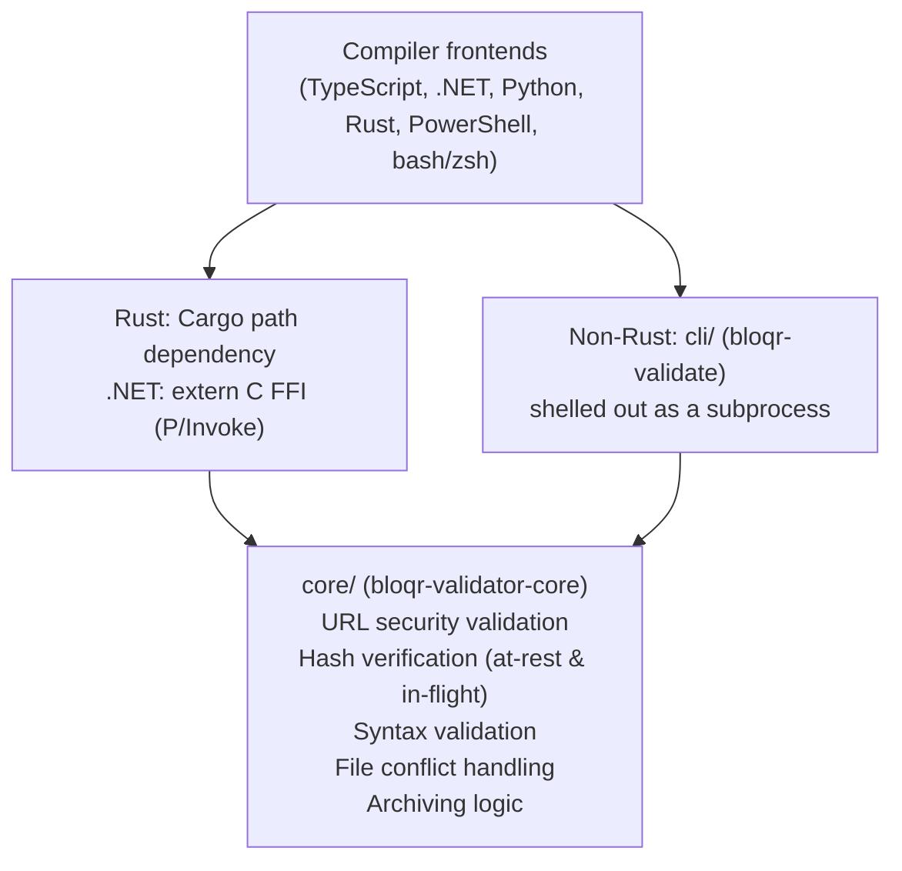

# Validation Library

Centralized Rust-based validation library for AdGuard filter compilation with comprehensive security features.

## Overview

This directory holds two Rust crates that provide a unified, high-performance validation layer shared by every language wrapper in `bloqr-core` (TypeScript, .NET, Python, Rust, PowerShell, shell):

- **[`core/`](core/)** — [`bloqr-validator-core`](https://crates.io/crates/bloqr-validator-core) (Rust import path: `bloqr_validator`), the validation library itself, consumed via a Cargo path dependency (Rust), a `extern "C"` FFI surface (.NET P/Invoke — see `core/src/ffi.rs` and the generated `core/bloqr_validator.h`), or the CLI below.
- **[`cli/`](cli/)** — [`bloqr-validator-core-cli`](https://crates.io/crates/bloqr-validator-core-cli), a thin binary wrapper (`bloqr-validate`) around the core library, shelled out to as a subprocess by the non-Rust, non-.NET language wrappers (TypeScript, Python, PowerShell, bash/zsh) that don't link the native library directly.

Both crates are published to crates.io independently — see each subdirectory's own README for install/usage details and [`docs/architecture/versioning-strategy.md`](../../docs/architecture/versioning-strategy.md) for the publishing pipeline.

## Features

- **At-Rest Hash Verification**: SHA-384 hashing for local files with automatic database management
- **In-Flight Hash Verification**: SHA-384 verification for downloaded files (prevents MITM attacks)
- **URL Security Validation**: HTTPS enforcement, SSRF-hardened redirect checking, content verification
- **Syntax Validation**: AdGuard `HostlistCompiler`-compatible linting for adblock and hosts file formats — see [`docs/adr/0003-adguard-hostlist-compatibility.md`](../../docs/adr/0003-adguard-hostlist-compatibility.md)
- **File Conflict Handling**: Automatic renaming, overwrite, or error strategies
- **Archiving**: Timestamped archiving with manifest tracking and retention policies

## Architecture



## Building

```bash
# From the repo root (this directory's crates are workspace members)
cargo build --release -p bloqr-validator-core -p bloqr-validator-core-cli
cargo test -p bloqr-validator-core -p bloqr-validator-core-cli
```

See [`core/README.md`](core/README.md) and [`cli/README.md`](cli/README.md) for crate-specific build outputs, FFI details, and per-language integration examples (Rust native, .NET P/Invoke, and CLI-subprocess usage from TypeScript/Python/PowerShell/shell).

## Security & Hardening

See [`core/README.md`](core/README.md#security--hardening) for SSRF hardening, streaming download size caps, and the CI gates (`cargo clippy`, `cargo deny check`, fuzz smoke tests) enforced on every PR touching this crate.

## License

GPL-3.0 - See [LICENSE](../../LICENSE) file for details

## Contributing

Contributions are welcome! Please ensure:
- All tests pass (`cargo test -p bloqr-validator-core -p bloqr-validator-core-cli`)
- Code is formatted (`cargo fmt -p bloqr-validator-core -p bloqr-validator-core-cli`)
- No clippy warnings (`cargo clippy -p bloqr-validator-core -p bloqr-validator-core-cli --all-targets`)
- Documentation is updated
